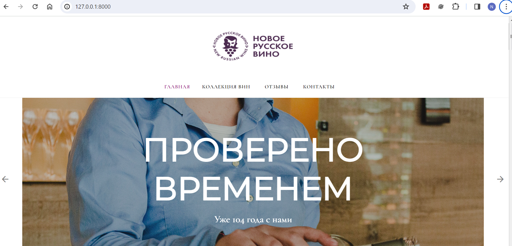

# Новое русское вино

Сайт магазина авторского вина "Новое русское вино".

## Установка

0. На вашем компьютере должен быть установлен Python3. Проект протестирован на Python 3.10.
1. Склонируйте проект к себе на компьютер, [подробнее](https://docs.github.com/en/repositories/creating-and-managing-repositories/cloning-a-repository).
2. Установите, запустите и активируйте виртуальное окружение, [подробнее](https://docs.python-guide.org/dev/virtualenvs/).
3. Чтобы установить зависимости, запустите
```python
pip install -r requirements.txt
```


## Запуск

- Запустите сайт командой
```python
python3 main.py
```
- Перейдите на сайт по адресу [http://127.0.0.1:8000](http://127.0.0.1:8000).

Если необходимо указать свой xlsx-файл с базой данных продуктов вместо используемого по умолчанию:
```python
python main.py -f [XLS FILE]
```
или 
```python
python main.py --xls_file [XLS FILE]
```

Работающий сайт выглядит примерно так:


## Цели проекта

Код написан в учебных целях — это урок в курсе по Python и веб-разработке на сайте [Devman](https://dvmn.org).
